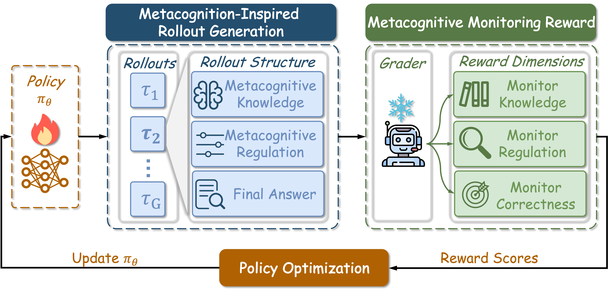

# MaR

This is the official code of the paper: [Metacognition as Reward: Reinforcing LLM Reasoning via Knowledge and Regulation Signals](https://arxiv.org/abs/2605.23384)

## 🔭 Overview of MaR



MaR follows a three-stage loop: the policy generates multiple structured rollouts consisting of metacognitive knowledge, metacognitive regulation, and the final answer; a grader scores each rollout along knowledge monitoring, regulation monitoring, and answer correctness; and the resulting reward scores are used to optimize the policy.

## 🚧 Code Release

The full code will be released soon. Stay tuned!

## 🖇️ Citation

🤝 Feel free to cite our paper if you find this repository benefits your work.

```bibtex
@misc{chen2026metacognitionrewardreinforcingllm,
      title={Metacognition as Reward: Reinforcing LLM Reasoning via Knowledge and Regulation Signals}, 
      author={Sirui Chen and Lei Xu and Yuying Zhao and Yutian Chen and Yu Wang and Beier Zhu and Hanwang Zhang and Shengjie Zhao and Chaochao Lu},
      year={2026},
      eprint={2605.23384},
      archivePrefix={arXiv},
      primaryClass={cs.CL},
      url={https://arxiv.org/abs/2605.23384}, 
}
```
